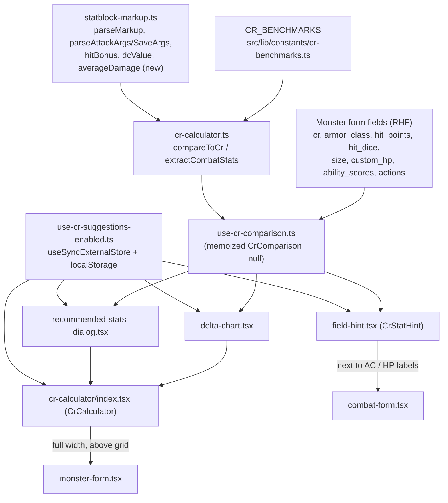

# CR Calculator (issue #118)

## Context

Monsterbrew has no live feedback on whether a creature's stats match its chosen Challenge Rating. Issue #118 asks for a self-contained "CR calculator" surfaced in the editor: a recommended-stats reference, per-field high/on-par/low hints, a delta chart, and a kill switch — all driven by the Lazy GM benchmark data already published on the guide (`src/lib/constants/cr-benchmarks.ts`). The guide (`src/routes/guide.quick-reference.tsx`, `src/app/guide/components/cr-benchmark-table.tsx`) currently only shows this data as static reference; this feature makes it live and interactive inside the editor.

I verified the codebase directly against the draft and confirmed: `CR_BENCHMARKS` (Lazy GM table, keyed by the same `cr` strings as `CHALLENGE_RATINGS`), the `CombatRolesChart` recharts pattern, the `resolveDiceAbilities`/`averageDice` dice-averaging internals, and the editor's section/hook/test conventions all exist as described. I also found and fixed three gaps the draft didn't address: **HP requires the same derived-value logic as the statblock preview** (not just the raw form field), **the editor-wide toggle must be shared live state, not independent per-component state**, and **the delta chart needs a normalized scale**, since the compared stats live on wildly different numeric ranges. Details below.

## Data & calculation layer

**`src/lib/statblock-markup.ts`** — add one new export, no changes to existing exports:

```ts
export function averageDamage(dice: string, ctx: MarkupContext): number {
  if (!dice) return 0;
  return averageDice(resolveDiceAbilities(dice, ctx));
}
```

This is the same math `damageClause` already does internally (`resolveDiceAbilities` then `averageDice`) minus the display formatting — verified `averageDice`'s own whitespace/sign compaction makes `normalizeSigns` unnecessary for a pure number. No need to `export` the two private helpers; just this wrapper.

**`src/lib/cr-calculator.ts`** (new, colocated test `cr-calculator.test.ts`, matching `statblock-markup.test.ts`):

- `crToNumber(cr: string): number` — converts a CR label to a number (`"1/8"` → `0.125`, `"1/4"` → `0.25`, `"1/2"` → `0.5`, else `Number(cr)`). No existing helper does this (checked `src/app/library/components/filters.ts`, the only other place that treats CR as a set of labels — it never converts to a number). Needed to actually apply the quick-reference formulas (see "Grounding in the quick-reference formulas" below), not just look up the table.
- `benchmarkForCr(cr: string): CrBenchmark | undefined` — `CR_BENCHMARKS.find(b => b.cr === cr)`.
- `extractCombatStats(monster: Pick<Monster, "actions" | "ability_scores" | "cr">): CombatStats` — iterate `monster.actions`, run each `description` through `parseMarkup` (`src/lib/statblock-markup.ts`), and for each tag segment:
  - `attack` → `parseAttackArgs`, track the **max** `hitBonus(f.hit, ctx)`, add `averageDamage(f.dice, ctx)` to the running damage sum.
  - `save` → `parseSaveArgs`, track the **max** `dcValue(f.dc, ctx)`, add `averageDamage(f.dice, ctx)` to the sum.
  - Bare `hit`/`dc`/`damage` tags (not inside a composite `attack`/`save`) are also picked up the same way for `attackBonus`/`saveDc`/damage sum respectively, so hand-typed non-composite tags aren't ignored.
  - **Ability-score fallback (addressing the note below):** yes — when _no_ attack/save/hit/dc tag is found anywhere in `monster.actions`, `attackBonus` and `saveDc` fall back to a projection from the creature's own stats instead of going empty: `const bestMod = Math.max(...Object.values(monster.ability_scores).map(calculateStatBonus)); attackBonus = bestMod + (monster.cr.proficiency_bonus || 0); saveDc = 8 + (monster.cr.proficiency_bonus || 0) + bestMod;`. This is exactly `hitBonus`/`dcValue`'s own formula (`src/lib/statblock-markup.ts:339-352`) applied to the creature's best ability instead of a tag-declared one — same math, just usable before any action text exists, so hints work immediately after ability scores + CR are set rather than staying blank until the user types a `{@attack}` tag. Each of `attackBonus`/`saveDc` carries a `source: "declared" | "projected"` tag so the dialog/hints can say which one they're showing.
  - `damagePerRound` has no such fallback (no formula ties dice damage to ability scores) — it stays a plain sum, `0` when no damage tag exists, paired with a `hasDamageData: boolean` so the UI can show a neutral "no attacks written yet" state instead of a false "way below benchmark."
  - _Scope, documented in a code comment_: only `monster.actions` is scanned (not traits/reactions/bonus/legendary actions) — v1 targets the primary attack/save line a statblock's "Actions" section carries, matching what the Lazy GM `damagePerRound`/`proficientBonus` benchmarks describe. This can't distinguish "makes two attacks" prose from a single tag and doesn't halve multi-target hits per the guide's own text — directional signal, not exact.
  - Return shape: `type CombatStats = { attackBonus: number; attackBonusSource: "declared" | "projected"; saveDc: number; saveDcSource: "declared" | "projected"; damagePerRound: number; hasDamageData: boolean }`.
- `classify(actual: number, benchmark: number, tolerance: number): "low" | "on-par" | "high"` — `actual < benchmark - tolerance` / `> benchmark + tolerance` / else on-par.
- `compareToCr(monster: Pick<Monster, "cr" | "armor_class" | "hit_points" | "hit_dice" | "size" | "custom_hp" | "ability_scores" | "actions">): CrComparison | null`:
  - `null` when `benchmarkForCr(monster.cr.challenge_rating)` finds nothing (empty/custom CR).
  - Effective HP must mirror `MonsterStatblock`'s own derivation (`src/components/monster-statblock.tsx:134-141`), not just the raw `hit_points` string: `const medianHP = calculateHitPoints(monster.hit_dice, monster.size, monster.ability_scores.con); const hpText = monster.custom_hp ? monster.hit_points : medianHP || monster.hit_points;` then `Number.parseInt(hpText, 10)` to get the actual number (both paths always start with a leading integer — `calculateHitPoints` in `src/lib/utils.ts` returns `"${medianHp} (${dice})"`, and hand-typed custom HP is expected in the same style). This keeps the calculator and the live preview from ever disagreeing about "what is this creature's HP."
  - AC: `armor_class` vs `benchmark.acDc`, tolerance ±1.
  - DC: `extractCombatStats(...).saveDc` vs `benchmark.acDc`, tolerance ±1.
  - HP: parsed HP vs `benchmark.hpAverage`, tolerance `benchmark.hpAverage - benchmark.hpMin` (i.e. the table's own spread, not an arbitrary percentage — see below).
  - Attack bonus: `extractCombatStats(...).attackBonus` vs `benchmark.proficientBonus`, tolerance ±1.
  - Damage/round: `extractCombatStats(...).damagePerRound` vs `benchmark.damagePerRound`, tolerance ±20% (see below for why this one stays a flat percentage).
  - `suggestedAbilityModifier = benchmark.proficientBonus - (monster.cr.proficiency_bonus || 0)` — `proficientBonus` is "ability mod + proficiency bonus combined" per the `CrBenchmark` doc comment; `monster.cr.proficiency_bonus` is proficiency bonus alone (set from `CHALLENGE_RATINGS` when the CR combobox is used), so the difference is the ability modifier the benchmark implies.
  - Return shape:
    ```ts
    type StatComparison = {
      actual: number;
      benchmark: number;
      classification: "low" | "on-par" | "high";
    };
    type CrComparison = {
      benchmark: CrBenchmark;
      ac: StatComparison;
      dc: StatComparison & { source: "declared" | "projected" };
      hp: StatComparison;
      attackBonus: StatComparison & { source: "declared" | "projected" };
      damagePerRound: StatComparison & { hasData: boolean };
      suggestedAbilityModifier: number;
    };
    ```

### Grounding in the quick-reference formulas

Directly answering "not sure if you actually based yourself on the formulas" — the short answer is: **the table (`CR_BENCHMARKS`), not a live formula computation, is the source of the target numbers**, because I checked and the two don't actually agree closely enough to compute one from the other. Working the quick-reference formulas by hand against the real table (`crToNumber` + `12 + cr/2`, `(15×cr)+15`, `4 + cr/2`, `(7×cr)+5`):

| CR  | formula AC/DC | table `acDc` | formula HP | table `hpAverage` | formula dmg/rd | table `damagePerRound` |
| --- | ------------- | ------------ | ---------- | ----------------- | -------------- | ---------------------- |
| 0   | 12            | 10           | 15         | 3                 | 5              | 2                      |
| 1   | 12.5          | 12           | 30         | 33                | 12             | 12                     |
| 5   | 14.5          | 15           | 90         | 95                | 40             | 35                     |
| 10  | 17            | 17           | 165        | 155               | 75             | 65                     |

They converge in the low-teens CR range and diverge everywhere else (CR0 is way off; damage/round is off by ~15% even at CR10). That's expected — the quick-reference page itself calls these "quick" formulas, a memorizable approximation of the real (hand-tuned, non-linear at the extremes) table the Lazy GM document publishes in full, which is exactly `CR_BENCHMARKS`. So: **`compareToCr` looks up `CR_BENCHMARKS` rows directly for every target value** (accurate, per-CR, already what the issue says to use), and the formulas earn their keep in two places where the table alone doesn't help:

1. **Tolerance for AC/DC/attack bonus stays ±1**, because the formulas' own slope (`half CR` per stat) means one whole point of tolerance already covers roughly ±2 CR levels of wiggle room — consistent with "adjust, don't hit exactly" being the guide's whole point, and cheap to defend with the formula's own rate of change.
2. **HP tolerance switches from a flat 20% to `hpAverage - hpMin`** (the table's own published spread), which _is_ the table's answer to "how much can HP vary and still be fine" — more accurate than guessing a percentage, and it's data we already have. Damage/round has no equivalent spread column in the table, so ±20% stays there as the closest analogue (it lands close to the HP table's own average/min ratio, e.g. ~25% at CR10) — flagged as the one remaining hand-picked number.
3. A new **cross-check test** in `cr-calculator.test.ts` asserts every `CR_BENCHMARKS` row falls within a generous band of its quick-reference formula prediction (the table above, loosened to something like `formula ± max(3, formula × 0.3)`), so if the two data sources are ever edited out of sync in the future, a test fails instead of the drift going unnoticed.

## Components — `src/app/editor/components/cr-calculator/`

New folder, mirroring `defense-form/`'s colocation (component + helpers + tests together, `index.tsx` re-exporting the drop-in component).

- **`use-cr-comparison.ts`** — `useFormContext<Monster>()` + `useWatch({ control, name: ["cr", "armor_class", "hit_points", "hit_dice", "size", "custom_hp", "ability_scores", "actions"] })`, memoized call into `compareToCr`. Single source every consumer below reads from.
- **`use-cr-suggestions-enabled.ts`** — **not** a plain per-instance `localStorage`-backed `useState` (the draft's version). `CrCalculator`'s toggle switch and `combat-form.tsx`'s two `CrStatHint`s are siblings, not parent/child, so independent `useState`s would desync — flipping the switch wouldn't hide the inline hints until remount. Instead, a tiny module-level store consumed via `useSyncExternalStore`:

  ```ts
  const KEY = "monsterbrew:cr-suggestions-enabled";
  const listeners = new Set<() => void>();
  let cached = true; // read lazily on first getSnapshot call in the browser

  function getSnapshot() {
    return cached;
  }
  function subscribe(cb: () => void) {
    listeners.add(cb);
    return () => listeners.delete(cb);
  }
  export function setCrSuggestionsEnabled(value: boolean) {
    cached = value;
    localStorage.setItem(KEY, String(value));
    listeners.forEach((cb) => cb());
  }
  export function useCrSuggestionsEnabled() {
    return useSyncExternalStore(subscribe, getSnapshot, () => true); // server snapshot
  }
  ```

  (init `cached` from `localStorage.getItem(KEY)` once, guarded for SSR the same way `monster-form.tsx`'s handoff effect already guards `localStorage` access.) This is the same plain-`localStorage` idiom the codebase already uses (`feedback-cta.tsx`, `monster-form.tsx`), just made observable so any component can flip it and every reader updates immediately — no new dependency, no context provider needed in `monster-form.tsx`.

- **`delta-chart.tsx`** — built on `recharts` `BarChart`/`ChartContainer`, same primitives as `CombatRolesChart` (`src/app/guide/components/combat-roles-chart.tsx`), reusing its mobile-axis-rotation (`useIsMobile`) and `ReferenceLine` treatment. **Scale fix vs. the draft**: raw signed deltas (`+2` AC vs `-40` HP) can't share one y-axis the way `CombatRolesChart`'s hand-authored `-2..2` role deltas do. Normalize each bar to **tolerance units**: `(actual - benchmark) / tolerance`, clamped to `±3`, so `1.0` means "right at the edge of on-par," matching the same tolerances `classify` uses (AC/DC/attack bonus tolerance = the flat ±1/±1/±1; HP/damage-per-round tolerance = `benchmark * 0.2`). This keeps the discrete symmetric-domain bar chart pattern (`domain={[-3.25, 3.25]}`) `CombatRolesChart` established, just driven by continuous data instead of hand-tuned constants. Wrapped in `Collapsible`/`CollapsibleTrigger`/`CollapsibleContent` (`src/components/ui/collapsible.tsx`, same primitives `CollapsibleSection` uses) — local `useState`, defaults open, no persistence.
- **`recommended-stats-dialog.tsx`** — self-contained `Dialog` + `DialogTrigger` (`src/components/ui/dialog.tsx`) `Button` reading `use-cr-comparison`'s `benchmark` row: AC, DC, HP (average + min–max), damage/round (+ `attacks` × `damagePerAttack`), attack/proficiency bonus, `suggestedAbilityModifier`. Styled like `cr-benchmark-table.tsx`'s `Table` usage. Renders `null` when `use-cr-comparison` is `null` (no benchmark) — no dialog trigger shown for a custom/empty CR.
- **`field-hint.tsx`** — `<CrStatHint stat="ac" | "hp" />`. Reads `use-cr-comparison` + `use-cr-suggestions-enabled` itself; renders `null` when disabled, no benchmark, or (for stats that can be `null`, not applicable to ac/hp) no data. Small icon (`TrendingUp`/`Minus`/`TrendingDown` from `lucide-react`) + "High"/"On par"/"Low" text. **Wraps itself in a local `<TooltipProvider delay={0}>`** (not relying on an ancestor one) since `combat-form.tsx` — unlike `defense-form/index.tsx` — has no `TooltipProvider` today; keeps `CrStatHint` genuinely drop-in per the issue's "incapsulated into it's own components" ask, with no required wrapper changes at the call site.
- **`index.tsx`** — exports `CrCalculator`: the toggle switch (writes via `setCrSuggestionsEnabled`, reads via `useCrSuggestionsEnabled`), the collapsible `DeltaChart`, and `RecommendedStatsDialog`, together. Takes no props (context-based, same convention as `CombatForm`/`DefenseForm`/`ActionsForm`). When disabled, still renders the toggle itself (so it can be switched back on) but hides the chart and dialog trigger.

## Integration points

- **`src/app/editor/components/monster-form.tsx`**: add `<CrCalculator />` (from `./cr-calculator`) right after the sticky Import/Save button row, above the two-column grid (`monster-form.tsx:129`) — full width. Zero prop wiring.
- **`src/app/editor/components/combat-form.tsx`**: add `<CrStatHint stat="ac" />` next to the `FieldLabel` for `armor_class` (`combat-form.tsx:297`), and `<CrStatHint stat="hp" />` in the Hit Points field's label row next to the existing "Manual" `Switch` (`combat-form.tsx:341-364`). Two additions, no structural changes to the file otherwise.
- **`src/lib/constants.ts`**: add a short doc comment directly above `CHALLENGE_RATINGS` (line 140) stating that only `proficiency_bonus` and `experience` are rules-canonical (verified against the official DMG CR table) and actively read elsewhere in the app, that `armor_class`/`save_dc`/`attack_bonus`/`damage_per_round`/`hit_points_range` are unused legacy columns kept only because the schema requires them, and pointing at `CR_BENCHMARKS` (`src/lib/constants/cr-benchmarks.ts`) as the table this feature (and any future build-guidance UI) should read instead. Answers the "why two CR tables" question in the code itself, not just in this doc.

## Data flow



## Testing

- `src/lib/statblock-markup.test.ts`: a few cases for `averageDamage` (flat dice, ability-keyword dice, empty string → 0).
- `src/lib/cr-calculator.test.ts`: `crToNumber` fraction/integer cases; `benchmarkForCr` lookups (hit + miss); `extractCombatStats` against hand-built actions using `{@attack m|str|5|2d8+str|slashing}` / `{@save dex|con|3d6|fire|half}` strings, including multiple actions summing damage and taking max hit/DC, **plus the ability-score-projection fallback** (empty `actions` array → `attackBonus`/`saveDc` computed from `ability_scores` + `cr.proficiency_bonus` with `source: "projected"`, vs. a tagged action giving `source: "declared"`); `classify` boundary cases at the tolerance edges; `compareToCr` end-to-end for a known CR (including the HP-derivation path with both `custom_hp` true/false, and the HP tolerance coming from `hpAverage - hpMin`) and the `null` no-benchmark path; the formula-vs-table cross-check asserting every `CR_BENCHMARKS` row stays within the documented margin of its quick-reference formula prediction.
- `src/app/editor/components/cr-calculator/*.test.tsx`: render through `renderWithForm` (`src/app/editor/components/test-utils.tsx`) — plain markup only, no router `Link`. Cover: toggle flips `CrStatHint` visibility in a _separately rendered_ sibling tree (proves the shared-store fix, not just same-tree state); dialog renders the right benchmark row's numbers; hint renders the correct label at a few actual-vs-benchmark deltas; chart bars clamp at the ±3 domain edge for extreme deltas.
- `combat-form.test.tsx`: extend to assert the two `CrStatHint`s render (or are absent when disabled via `setCrSuggestionsEnabled(false)`).

## Verification

- `pnpm exec vitest run` for the new/updated test files above.
- `pnpm lint`.
- `pnpm dev`, open `/editor`, pick a CR, adjust AC/HP/actions (add an `{@attack}`/`{@save}` tag), confirm: delta chart updates and collapses, recommended-stats dialog shows the right benchmark row, AC/HP hints update live, and toggling the switch off hides chart + dialog trigger + both hints immediately (no reload needed) — this last check specifically exercises the shared-store fix.
- Also check the fallback path: pick a CR on a brand-new creature with ability scores set but **no actions written yet** — the dialog's attack-bonus/DC figures should already show a "projected" value (not blank), and adding an `{@attack}`/`{@save}` tag afterward should flip them to "declared" and (likely) change the number.

## Feedback / Notes

Overall, the plan looks good but I still have some questions. First, it seems we have two Challenge rating tables now, one in constants.ts and one in cr-benchmark, both have slightly different number in them. Can we consolidate these so we just have one source of truth?
Second, the math seems right, but not sure if you actually based yourself on the formulas found in quick-reference or not?

### Answers

**Q2 (formulas)** — answered in place above ("Grounding in the quick-reference formulas"): the table is the source of truth for target numbers because I verified by hand that the formulas and the table diverge too much to compute one from the other (e.g. CR0 AC: formula says 12, table says 10; CR10 damage/round: formula says 75, table says 65). The formulas now do real work — deriving the AC/DC/attack-bonus tolerance and the HP tolerance — instead of being unused, plus a new cross-check test that fails if the two ever drift apart by more than a generous margin.

**Q1 (two CR tables)** — I pulled the full `CHALLENGE_RATINGS` array (`src/lib/constants.ts:140-481`) and diffed it against `CR_BENCHMARKS` row by row, and also grepped the whole codebase for every place that reads `cr.armor_class`, `cr.save_dc`, `cr.attack_bonus`, `cr.damage_per_round`, `cr.hit_points_range` — **zero hits**. Only `cr.challenge_rating`, `cr.proficiency_bonus`, and `cr.experience` are ever read anywhere outside the schema/constants file itself (confirmed in `statblock-markup.ts`, `monster-statblock.tsx`, `combat-form/index.tsx`). So:

- **They're not duplicates of the same thing.** `CHALLENGE_RATINGS.proficiency_bonus` and `.experience` are the official D&D 2014/2024 DMG "Monster Statistics by Challenge Rating" numbers — I checked them against the real DMG table and they're exact (CR5 → PB +3, XP 1,800; CR20 → PB +6, XP 25,000; etc.). Those two fields are rules-canonical and can't be swapped for the Lazy GM numbers without making the app report the wrong official proficiency bonus/XP for a creature — that's a correctness regression, not a cleanup.
- **The other five `CHALLENGE_RATINGS` fields (`armor_class`, `save_dc`, `attack_bonus`, `damage_per_round`, `hit_points_range`) are dead data** — required by the schema (`challengeRatingSchema`) and populated in `CHALLENGE_RATINGS`/`defaultMonster`, but never read by any component, converter, or calculation. They also have a real data-quality bug worth a separate look: `armor_class` and `save_dc` track each other almost exactly through CR16, then `armor_class` freezes at 19 for every CR from 17 through 30 while `save_dc` keeps climbing to 23 — I can't fully confirm from memory whether the real DMG table actually plateaus AC there or if this is a transcription error, but either way it's evidence these five columns haven't been exercised or double-checked in a while, which is exactly what "unused" data invites.
- **Recommendation: don't merge the tables** — merging would mean either overwriting the rules-canonical `proficiency_bonus`/`experience` with Lazy-GM-derived numbers (wrong), or overwriting `CR_BENCHMARKS`' richer, hand-tuned build guidance with the DMG's simpler/buggier columns (worse for what this feature needs — no `hpMin`/`hpMax`, `attacks` count, `damagePerAttack` dice, or example monsters). Instead:
  1. The CR calculator (as already scoped above) reads `CR_BENCHMARKS` for every build-guidance number, and touches `CHALLENGE_RATINGS`/`monster.cr` for exactly one thing: `cr.proficiency_bonus`, to derive the ability-modifier suggestion and the ability-score-projection fallback. It never reads `cr.armor_class`/`cr.save_dc`/`cr.attack_bonus`/`cr.damage_per_round`.
  2. Add a short doc comment above `CHALLENGE_RATINGS` in `constants.ts` stating plainly which fields are rules-canonical (`proficiency_bonus`, `experience`) vs. unused legacy columns, and pointing at `CR_BENCHMARKS` as the actively-used build-guidance table — so the next person hitting "why are there two CR tables" gets the answer in the code, not just in this doc.

  _Considered and dropped: actually deleting the five dead columns._ I traced the blast radius before deciding — `challengeRatingSchema` (`monster-schema.ts`) requires them, `defaultMonster.cr` and the legacy `createCreatureSchema.ts`'s `cr` both carry them, and every import converter (5eTools, Improved Initiative, SRD, Tetra Cube, Open5e) builds `monster.cr` via the shared `findChallengeRating` helper (`monster-mappers.ts`) off this same array — so trimming it is a real schema change, not a comment. It's very likely safe (Zod drops unknown keys by default, `to-markdown.ts`/`statblock-markup.ts`/`monster-statblock.tsx` only ever read the 3 kept fields, and `creatureToMonster.ts`'s legacy passthrough would just carry the narrower shape forward), but it touches the legacy schema CLAUDE.md says not to build on, plus every converter's return type, for a payoff that's cosmetic (dead fields, not a bug users hit). Punting it to a separate, focused cleanup PR outside this feature's scope — the doc comment above is enough to stop the next person from being confused by it in the meantime.
